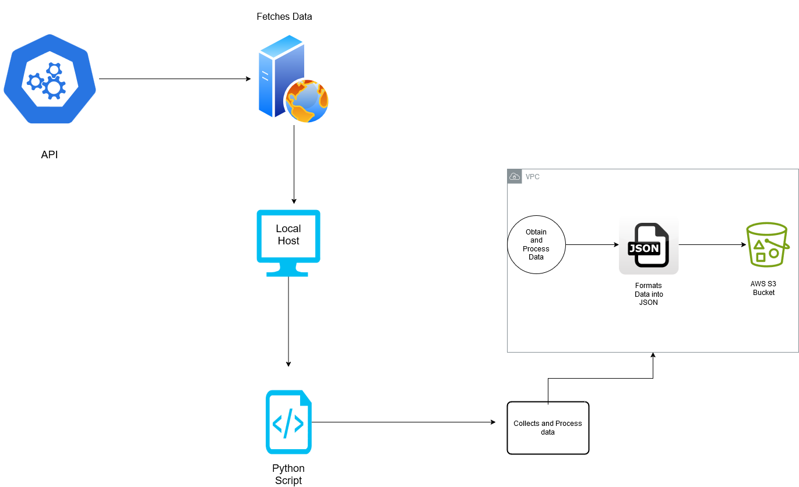

<h1>DBuilding a Weather Data Collection system using AWS S3 and OpenWeather API</h1>
Day 1 of 30 Day DevOp Challaenge 
<h2>Overview</h2>

This project grabs real-time weather data for multiple cities. It displays temperature (°F), humidity, and weather conditions. Then it automatically stores weather data in an AWS S3 bucket.

 
<h2>Prerequisites</h2> 
<li>AWS Account: To use S3 and AWS CLI</li>
<li>API Key from OpenWeather: Sign up at https://home.openweathermap.org/users/sign_up to obtain a free tier API key.</li>
<li>Cli/Termial: To use Python and any needed dependencies</li>
<li>A Code/Text Editor: To edit any code if needed</li>

